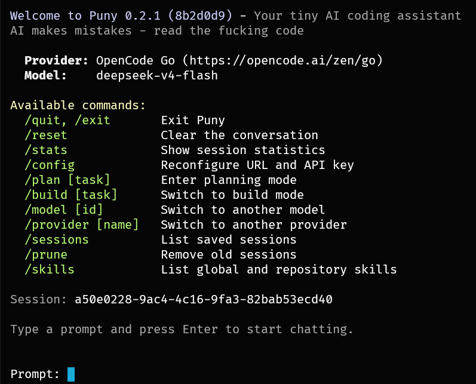
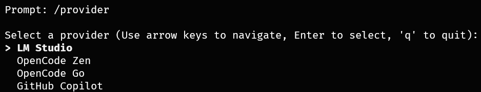
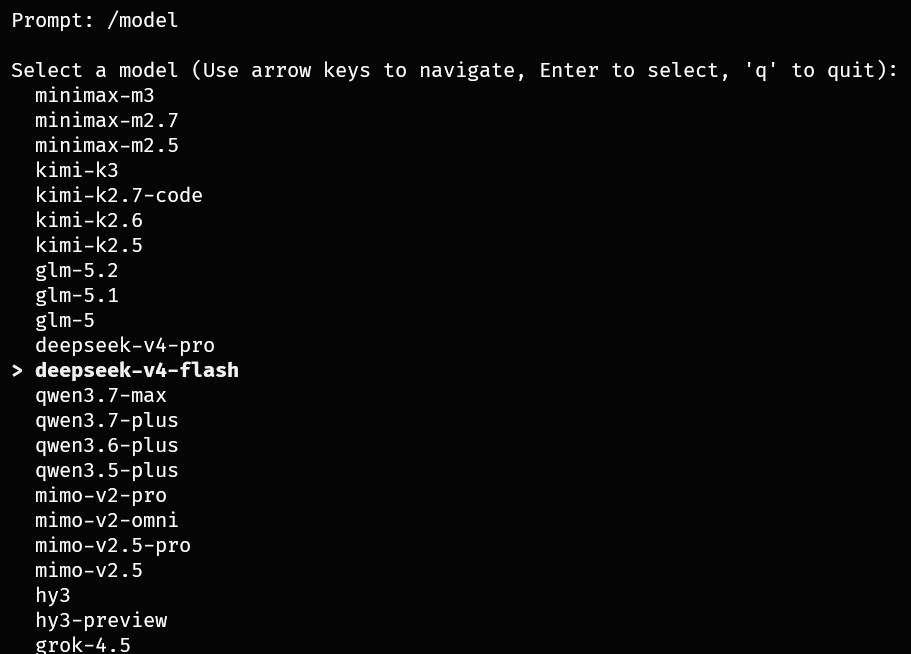

# Puny

Puny is a minimal natively compiled single-binary coding agent with a ~1 MB footprint.

It's designed for people who want a fast, lightweight coding agent that runs smoothly 
on limited hardware or remote machines. This is a coding agent that starts in under 1
millisecond, uses around 1 MB of disk space, uses minimal memory, uses <1% CPU,
and stays out of your way.

## Features

- **Multiple providers**: local-first LM Studio, or hosted models via OpenCode Zen, OpenCode Go, or your GitHub Copilot subscription.
- **Interactive model picker**: choose the model to load when Puny starts.
- **Multi-turn chat**: keeps the conversation history across messages.
- **Session management**: each run and `/reset` creates a new UUID-identified session, with the conversation automatically saved after every turn and PRDs saved to the session folder. Sessions can be resumed with `/resume` or `--session`.
- **Tool calling**: the LLM can use built-in tools to work with your project.
- **Skills system**: extend Puny with reusable prompt-engineering skills stored in markdown files.
- **Built-in tools**:
  - Read, write, and list files in your project
  - Run shell commands
  - Search your codebase
  - Load skills
  - Fetch web pages

## Why fast and small matters

Startup time ~1ms means Puny is always ready when you are — no spinner, no animations, no
waiting. The ~1 MB binary and minimal memory footprint mean it runs comfortably on
a Raspberry Pi, a slow remote server over SSH, or a cheap decade-old laptop. 
Every millisecond and megabyte is deliberate: there is no hidden runtime, no garbage collector, 
no Node.js dependencies, no JavaScript.

## Why the feature set is intentionally limited

Puny is designed around the way I work. It is highly opinionated. That means it will
never try to be everything to everyone. It's a tool and will take credit itself for your work
by adding itself as a co-author to your commits. It will never try to be a platform, a framework, 
or a plugin ecosystem. 

Other coding agents include MCP, subagents, plugins, extensions, animations, and dozens
of other features I never asked for. Puny does not. The feature set is limited to what
I need to get results: read files, write files, run commands, search code, load skills,
fetch web pages. If you want parallel work, run another instance.

Each feature earns its place. Nothing ships because it looks good on a comparison table.
This is not a platform — it is a tool.

Puny does not show the model's reasoning or thinking output by default. I do not care
about the model's internal monologue. I see it as a wall of text, a huge TL;DR you have
to scroll past to get to the actual answer. If you want it, pass `--show-thinking`.
If you think you want it later, pass `--chat-log` which saves the entire conversation,
noise included, to puny_chat.log

The four supported providers are the ones I use personally:

- [LM Studio](https://lmstudio.ai/) — local inference on my own hardware
- [OpenCode Zen](https://opencode.ai/zen) — wide selection of reliable optimized models
- [OpenCode Go](https://opencode.ai/go) — cheaper hosted models when I need them
- [GitHub Copilot](https://github.com/features/copilot) — comes with my GitHub subscription

Puny lets you chat with an LLM and gives it a curated set of coding tools so it can
read, edit, search, and inspect your codebase.

## Screenshots

| Welcome screen               | Provider picker                      | Model picker                      |
| ---------------------------- | ------------------------------------ | --------------------------------- |
|  |  |  |

## Installation

### Quick Install (Recommended)

**Linux/macOS:**

```bash
curl -fsSL https://christianhelle.com/puny/install | bash
```

**Windows (PowerShell):**

```powershell
irm https://christianhelle.com/puny/install.ps1 | iex
```

The install scripts download the latest release from GitHub and install the binary (Linux/macOS detects x86_64 and aarch64; Windows currently installs the x86_64 build).

**Custom installation directory:**

```bash
# Linux/macOS
curl -fsSL https://christianhelle.com/puny/install | bash -s -- --dir "$HOME/.local/bin"
# Windows
$install = irm https://christianhelle.com/puny/install.ps1
& ([scriptblock]::Create($install)) -InstallDir "C:\Tools"
```

**Pin a specific version:**

```bash
# Linux/macOS
VERSION=v0.1.0 curl -fsSL https://christianhelle.com/puny/install | bash

# Windows
$install = irm https://christianhelle.com/puny/install.ps1
& ([scriptblock]::Create($install)) -Version "v0.1.0"
```

### Upgrade

If Puny is already installed, upgrade to the latest version:

```bash
puny --upgrade
```

This re-runs the install script for your platform.

### Build from source

Requires [Zig](https://ziglang.org/) 0.16.0 or later.

```bash
git clone https://github.com/christianhelle/puny.git
cd puny
zig build
```

The compiled binary is written to `zig-out/bin/puny`.

To build a release binary and install it to `$HOME/.local/bin` (the same directory used by the install scripts), run:

```bash
zig build install-release
```

The install directory can be overridden with the `INSTALL_DIR` environment variable or the `--prefix` flag:

```bash
INSTALL_DIR=/custom/path zig build install-release
zig build install-release --prefix /custom/path
```

## Quick start

### LM Studio

Start LM Studio and load a model with tool-calling support, then:

```bash
puny
```

Or, if you are running from the source tree:

```bash
zig build run
```

### OpenCode Zen

Sign in to [OpenCode Zen](https://opencode.ai/zen), copy your API key, then:

```bash
puny --provider opencode --api-key YOUR_API_KEY
```

Puny connects to `https://opencode.ai/zen` and shows the model picker.
Models served over OpenCode Zen's OpenAI-compatible `/v1/chat/completions`
transport are listed (DeepSeek, GPT, GLM, Kimi, MiniMax, Grok, Big Pickle, and the free models),
plus Qwen and Claude models served over Anthropic's `/v1/messages` transport,
and Gemini models served over Google's `/v1/models/<model>:streamGenerateContent` transport.

### OpenCode Go

Sign in to [OpenCode Zen](https://opencode.ai/zen), subscribe to Go, copy your API key (same key for Zen and Go), then:

```bash
puny --provider opencode-go --api-key YOUR_API_KEY
```

Puny connects to `https://opencode.ai/zen/go` and shows the model picker.
Go models are served over OpenAI-compatible `/v1/chat/completions` (DeepSeek, Grok, GLM, Kimi, MiMo)
and Anthropic `/v1/messages` (MiniMax, Qwen) transports.

### GitHub Copilot

Use Puny with your existing [GitHub Copilot](https://github.com/features/copilot) subscription:

```bash
puny --provider copilot
```

Puny resolves a GitHub OAuth token in this order:

1. A token you supply manually via `--api-key`, `--api-key-file`, `PUNY_API_KEY`,
   `config.json`, or the `GITHUB_COPILOT_OAUTH_TOKEN` environment variable.
2. Auto-discovery of an existing token from the GitHub Copilot editor plugin
   (`apps.json`/`hosts.json`) or from OpenCode's `auth.json`.
3. An interactive device-flow login: Puny prints a code and a URL to open in your
   browser, then persists the acquired token to `config.json` for future runs.

It then exchanges that OAuth token for a short-lived Copilot token and shows the model
picker. The picker lists the same curated models the GitHub Copilot CLI offers — the
models your subscription marks as picker-enabled that are served over the OpenAI-compatible
`/chat/completions` endpoint. Legacy models (e.g. GPT-3.5, GPT-4o), internal agent models,
and `/responses`-only models (e.g. GPT-5.5, GPT-5 Codex) are filtered out because Puny
can't drive them. The general-purpose `GH_TOKEN`/`GITHUB_TOKEN` environment variables are
intentionally **not** used, so an unrelated GitHub token can't break the exchange.

Support for GitHub Copilot is experimental, but both chat and tool calling work across the
listed models (Claude, GPT-5 mini, Gemini, Kimi, and more).

## Usage

Make sure LM Studio is running and a tool-capable model is loaded, then start Puny:

```bash
puny
```

Puny shows the model picker, connects to LM Studio, and drops you into a chat prompt.

### Interactive chat

Type your request and press Enter:

```text
Prompt: Explain what this project does
```

The model replies in the terminal. You can keep sending follow-up messages; Puny remembers the conversation.

```text
Prompt: Now list the source files

🔧 Listing directory "src"

The project has source files under src/, including main.c, utils.h, and a tests/ folder.
```

### One-shot prompt

Run a single prompt and exit. Useful for scripts or quick tasks:

```bash
puny --prompt "List all source files" --oneshot
```


### Prompt from a file or URL

Load the first prompt from a local file or an `http://`/`https://` URL, either
at startup via the CLI or interactively with `/file`:

```bash
# CLI: local file or remote URL, optionally one-shot
puny --prompt-file spec.md --oneshot
puny --prompt-file https://example.com/spec.md

# Interactive
/file spec.md
/file https://example.com/spec.md
```

At startup, `--prompt-file` loads the content and sends it as the first user
message, exactly like `--prompt`. `--oneshot` accepts `--prompt-file` in place
of `--prompt`, and using both `--prompt` and `--prompt-file` is an error.

In the interactive loop, `/file` loads the content and sends it as the next
user message instead.

Both flows load from local files or remote URLs; local files and remote
responses are limited to 10 MiB, and remote fetches time out after 30 seconds.

### Select a provider

Use `--provider` to switch between LM Studio (`lmstudio`, the default), OpenCode Zen (`opencode`), OpenCode Go (`opencode-go`), and GitHub Copilot (`copilot`). You can also set `PUNY_PROVIDER` or the `provider` field in `config.json`.

```bash
puny --provider opencode --api-key YOUR_API_KEY
```

Precedence is: `--provider` > `PUNY_PROVIDER` > `config.json` > `lmstudio`.

### Connect to a remote LM Studio instance

If LM Studio is running on another machine, point Puny at it:

```bash
puny --url http://192.168.1.42:1234
```

### Authenticate

If your provider requires an API token, provide it via CLI, environment variable, config file, or `--reconfigure`:

```bash
# CLI flag (session only)
puny --api-key lmstudio-token-123

# Environment variable (session only)
export PUNY_API_KEY=lmstudio-token-123
puny

# Read from a file (session only)
puny --api-key-file /run/secrets/lmstudio-key

# Save to config interactively
puny --reconfigure
```

Precedence is: `--api-key` > `--api-key-file` > `PUNY_API_KEY` > `config.json`.

OpenCode Zen requires an API key. Puny exits early with a hint if the key is missing.

GitHub Copilot does not need an API key up front — Puny discovers an existing GitHub
OAuth token or runs a device-flow login on first use, then persists it. You can still
supply a token manually (via `--api-key`, `PUNY_API_KEY`, or `GITHUB_COPILOT_OAUTH_TOKEN`)
to skip discovery and login.

### Save provider and API key to config

Run `--reconfigure` to choose a provider and save its URL and API key to `config.json`:

```bash
puny --reconfigure
```

You will be prompted for:

1. **Provider** — `lmstudio`, `opencode`, `opencode-go`, or `copilot`.
2. **Provider URL** — press Enter to use the provider's default. (OpenCode Zen's URL is fixed at `https://opencode.ai/zen`; GitHub Copilot's is fixed at `https://api.githubcopilot.com`.)
3. **API key** — press Enter to keep the existing key, or `-` to clear it.

Once saved, Puny uses the stored provider and key on subsequent runs, so you only need to pass `--provider` or `--api-key` again if you want to override them for a single session. If an OpenCode Zen request fails with an authentication error, Puny prints an auth hint; use `--reconfigure` to update the key.

`--url` and `PUNY_PROVIDER_URL` only affect LM Studio; OpenCode Zen always uses `https://opencode.ai/zen` and GitHub Copilot always uses `https://api.githubcopilot.com`.

The config file stores per-provider settings (URL, API key, and last-selected model) so you can switch between providers without re-entering credentials.

## Skills

Puny can load reusable prompt-engineering skills from markdown files. Skills are
instructions that get injected into the system prompt so the model knows how to
behave for a specific task. They can be loaded by slash command, by mentioning
a trigger phrase in your message, or by the model itself via tool call.

### Skill locations

Puny scans two directories for skills:

- **Global**: `~/.agents/skills/` — skills available across all repositories
- **Repository**: `<repo-root>/.agents/skills/` — project-specific skills (auto-detected via `git rev-parse --show-toplevel`)

Each subdirectory inside these paths is treated as a skill. The skill's name is the
directory name.

### Skill structure

A skill directory must contain a `SKILL.md` file. The file starts with YAML frontmatter
that can include the following fields:

```markdown
---
name: my-skill
description: >
  Expert knowledge of MyTool for integration testing.
  Covers setup, configuration, and common patterns.
triggers: mytool, integration test, configure
disable-model-invocation: false
---

# MyTool Instructions

When asked about MyTool, follow these guidelines...
```

| Field                      | Required | Description                                                                                |
| -------------------------- | -------- | ------------------------------------------------------------------------------------------ |
| `name`                     | Yes      | Canonical identifier (must match the directory name)                                       |
| `description`              | Yes      | Short summary shown in `/skills` output and the `<available_skills>` block                 |
| `triggers`                 | No       | Comma-separated phrases that auto-load the skill when mentioned in a user message          |
| `disable-model-invocation` | No       | Set to `true` to prevent the model from loading this skill via tool call (default `false`) |

The body after the frontmatter is the skill content that gets injected into the
conversation when the skill is loaded.

### Loading a skill

Skills can be loaded in three ways:

1. **Slash command** — type `/<skill-name>` in the prompt:

   ```text
   Prompt: /nano-commits
   ```

2. **Keyword trigger** — mention a trigger phrase from the skill's `triggers` field in your
   message. For example, a `caveman` skill with `triggers: talk like caveman, be brief`
   loads automatically when you say:

   ```text
   Prompt: talk like caveman from now on
   ```

   Skills are also triggered by their directory name as a whole word — saying
   `grill me on this design` loads the `grill-me` skill.

3. **Model invocation** — the model can load a skill it considers relevant by calling the
   `load_skill` tool. This happens automatically when the model sees a matching skill in
   the `<available_skills>` block. Skills with `disable-model-invocation: true` won't
   appear for model invocation and must be loaded by slash command only.

### Listing available skills

Use `/skills` to list all discovered skills from both global and repository locations:

```text
Prompt: /skills

Available skills:

  nano-commits
  grill-me
```

Skills with a `description` field in their frontmatter show a description next to
their name.

### How skills work

When Puny starts, it scans both skill directories and builds a registry. Available
skills and their descriptions (if scanned) are injected into the system prompt as an
`<available_skills>` block:

```xml
<available_skills>
  <skill>
    <name>nano-commits</name>
    <description>Commit often. One logical change per commit.</description>
  </skill>
</available_skills>
```

When a skill is loaded (via slash command, keyword trigger, or model invocation),
Puny reads the `SKILL.md` body, strips the frontmatter, and adds the content as a
system message. The model can then follow the skill's instructions for the remainder
of the conversation.

Skills stay loaded for the session. To clear all loaded skills, use `/reset`.

## Tool calling

Puny sends a list of available tools to the model on every request. When the model decides to call a tool, Puny executes it automatically and feeds the result back into the conversation.

Tool-call status lines use concise action-oriented summaries instead of raw JSON:

```text
🔧 Reading "src/main.zig"
🔧 Running "zig build test"
🔧 Writing 12 lines (384 bytes) to "README.md"
```

Large payloads, such as file writes, are summarized rather than printed in full.

### ⚠️ Safety warning - YOLO mode by default

Tools execute **automatically without confirmation**. This includes file writes (which overwrite files) and shell commands (which run arbitrary commands). Only run Puny in directories where you are comfortable with the model making changes.

## Reference

### CLI options

| Flag                    | Description                                                                               |
| ----------------------- | ----------------------------------------------------------------------------------------- |
| `--provider <name>`     | Provider: `lmstudio`, `opencode`, `opencode-go`, or `copilot` (env/config/CLI precedence) |
| `-u`, `--url <url>`     | LM Studio endpoint URL (default: `http://127.0.0.1:1234`)                                 |
| `-k`, `--api-key <key>` | Provider API token (session only)                                                         |
| `--api-key-file <path>` | Read provider API token from file (session only)                                          |
| `--chat-log`            | Save full conversation (including reasoning) to `puny_chat.log`                           |
| `-m`, `--model <id>`    | Model identifier (skips picker if found in running models)                                |
| `-p`, `--prompt <text>` | Pre-fill prompt as first user message                                                     |
| `--prompt-file <file-or-url>` | Read first prompt from a file or URL (10 MiB limit) |
| `-1`, `--oneshot`       | Exit after processing the prompt (requires `--prompt` or `--prompt-file`)                                    |
| `-M`, `--mock`          | Use mock provider (no backend required)                                                   |
| `--reconfigure`         | Re-run first-run setup and update config                                                  |
| `--show-thinking`       | Show reasoning/thinking output from the model                                             |
| `--session <id>`        | Resume a previous session by UUID or unique prefix                                        |
| `--resume`              | Resume the most recent session with a saved conversation                                  |
| `--prune`               | Delete old sessions (use with `--session` to keep one)                                    |
| `--debug`               | Log HTTP requests and responses to `puny_debug.log`                                       |
| `-U`, `--upgrade`       | Upgrade to the latest release via install script                                          |
| `-h`, `--help`          | Show help text                                                                            |
| `-V`, `--version`       | Print version                                                                             |

### Environment variables

| Variable                     | Description                                         |
| ---------------------------- | --------------------------------------------------- |
| `PUNY_CHAT_LOG`              | Set to `1` or `true` to save full conversation to `puny_chat.log` |
| `PUNY_PROVIDER`              | Default provider name (overrides config)            |
| `PUNY_PROVIDER_URL`          | LM Studio endpoint URL (overrides config/CLI)       |
| `PUNY_API_KEY`               | Provider API token (overrides config, session only) |
| `PUNY_MODEL`                 | Default model identifier (overrides config)         |
| `PUNY_MOCK`                  | Set to `1` or `true` to enable mock provider        |
| `PUNY_SHOW_THINKING`         | Set to `1` or `true` to show reasoning output       |
| `GITHUB_COPILOT_OAUTH_TOKEN` | GitHub OAuth token for Copilot provider             |

### Interactive commands

While in a chat session:

- `/quit` or `/exit` — exit Puny
- `/reset` — clear the conversation, start a new session, and unload all skills
- `/stats` — show session statistics and memory usage
- `/config` — reconfigure provider, URL, and API key mid-session; changing the provider rebuilds the connection and re-opens the model picker
- `/plan [task]` — enter planning mode (optionally with a task description); the resulting PRD is saved to the session folder as `plan.md`
- `/build [task]` — switch to build mode (optionally with a task description)
- `/model [id]` — switch to another model; shows the model picker if no ID is given
- `/provider [name]` — switch to another provider without reconfiguring everything; shows the provider picker if no name is given, then opens the model picker for the new provider
- `/sessions` — list all saved sessions, showing their UUID, whether they have a `plan.md` or saved conversation, and a preview of the first user message
- `/resume [id]` — list saved sessions and pick one to restore, or restore a specific session by UUID prefix
- `/prune` — delete all session directories except the current one
- `/skills` — list all available global and repository skills
- `/file <path|url>` — load a prompt from a local file or URL and send it as the next message

Any unrecognized slash command (e.g. `/nano-commits`, `/grill-me`) is treated as a
skill name and loads the matching skill if found.

Skills also load automatically when your message contains the skill's directory name
or a trigger phrase listed in its frontmatter `triggers` field. The model can also
load skills on its own via the `load_skill` tool.

### Sessions

Each Puny session is identified by a UUID. A new session is created every time you
start Puny or run `/reset`. The session ID is shown in the welcome screen and in
the `/stats` header.

#### Storage

Sessions are stored at `~/.config/puny/sessions/<uuid>/` (Linux/macOS) or
`%APPDATA%\puny\sessions\<uuid>\` (Windows). The base directory is configurable:
use `$XDG_CONFIG_HOME/puny` when set on Linux/macOS, and on Windows fall back to
`%USERPROFILE%\puny` when `%APPDATA%` is unavailable. Each session folder can contain:

| File            | Description                                                     |
| --------------- | --------------------------------------------------------------- |
| `plan.md`       | PRD markdown produced by the model during `/plan` mode          |
| `plan.html`     | HTML version of the PRD                                         |
| `messages.json` | Full conversation history, saved automatically after every turn |
| `session.json`  | Session metadata (planning mode, first user prompt)             |

#### Conversation persistence

The entire conversation is saved to `messages.json` in the session folder after
every completed chat turn. It is also saved automatically when you exit the
session (`/quit`, `Ctrl+C`) or run `/reset`. Tool call results are included in
the save so the restored session has the full context.

Sessions that end with no real content — no user message, no assistant reply,
and no `plan.md`/`plan.html` — are removed automatically on exit so empty
session folders don't accumulate.

#### Restoring a session

You can resume a previous session in several ways:

- **CLI flag**: `puny --session <uuid-or-prefix>` loads a specific session by
  UUID or unique prefix. Use `--session` with a partial UUID for prefix matching
  (e.g. `puny --session abc-12` matches `abc-1234-...`).
- **CLI flag**: `puny --resume` resumes the most recent session with a saved
  conversation. If multiple sessions have saved conversations, a hint is printed.
- **CLI flag**: `puny --prune` deletes all session directories. Use
  `puny --prune --session <uuid>` to delete all sessions except the one to keep.
- **Interactive**: `/resume` inside a chat session lists all saved sessions
  that have conversations and lets you pick one to restore. You can also pass
  a prefix: `/resume abc-12`.
- **In-session restore**: Calling `/resume` replaces the current conversation
  with the saved one, keeping the same provider and model configuration.

When a session is restored, the system prompt, skills blocks, and planning mode
are restored exactly as they were saved — the conversation picks up where it
left off.

#### Planning mode

In planning mode the model can only read files, list directories, search code,
check git status/diff, and fetch web pages — plus use the `save_prd` tool to
write the final PRD. When the user confirms readiness, the model calls
`save_prd` with markdown and HTML content, which writes both `plan.md` and
`plan.html` to the session folder. Planning mode state is persisted in
`session.json` and restored when the session is resumed.

## Build from source

Requires [Zig](https://ziglang.org/) 0.16.0 or later.

```bash
zig build
```

The compiled binary is written to `zig-out/bin/puny`. Copy it to a directory on your PATH to run it from anywhere.

To build a release binary and install it to `$HOME/.local/bin` (the same directory used by the install scripts), run:

```bash
zig build install-release
```

The install directory can be overridden with the `INSTALL_DIR` environment variable or the `--prefix` flag:

```bash
INSTALL_DIR=/custom/path zig build install-release
zig build install-release --prefix /custom/path
```

Run the test suite:

```bash
zig build test
```

Run the regression test suite:

```bash
zig build test-regression
```

## Development / testing

### Mock mode (no LM Studio, OpenCode Zen, or Github Copilot required)

Start without a running AI backend:

```bash
zig build run -- --mock
```

You can also set the `PUNY_MOCK` environment variable:

```bash
export PUNY_MOCK=1
zig build run
```

The mock provider returns canned responses and simulates tool calls based on keywords in your prompt:

| Prompt contains            | Mock response                                 |
| -------------------------- | --------------------------------------------- |
| `read`, `file`, `code`     | Calls `read_file` tool                        |
| `search`, `grep`, `find`   | Calls `grep_search` tool                      |
| `shell`, `run`, `execute`  | Calls `execute_shell` tool                    |
| `error`, `timeout`, `fail` | Simulates a network error                     |
| _(after a tool result)_    | Returns a completion acknowledging the result |
| _(anything else)_          | Returns a canned text response                |

Use `--model` to skip the model picker in mock mode:

```bash
zig build run -- --mock --model mock-model --prompt "search for something" --oneshot
```

### Show thinking/reasoning output

To see the model's internal reasoning (thinking) output, use `--show-thinking`:

```bash
puny --show-thinking
```

Or set the `PUNY_SHOW_THINKING` environment variable:

```bash
export PUNY_SHOW_THINKING=true
puny
```

### HTTP debug logging

To log all HTTP requests and responses to `puny_debug.log`, use `--debug`:

```bash
puny --debug
```

The debug log captures request payloads, response headers, and SSE chunks for troubleshooting. JSON bodies are pretty-printed for readability.

## License

MIT
